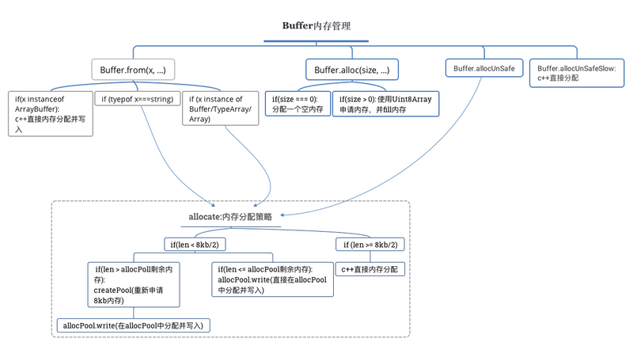

# buffer   

### 1、概念

    buffer 存在的价值是解决二进制的问题，string处理的类型有限，比如net网络传输二进制数据的时候，解决不了问题，因此buffer就应运而生了。buffer创建的空间在slab，它不在V8中，在V8外边创建，你可以理解为C／C++为buffer创建了一块存储空间。

```js

// 生成一个256字节的Buffer实例
var bytes = new Buffer(256);

// 遍历每个字节,写入内容,初始化
for (var i = 0; i < bytes.length; i++) {
    bytes[i] = i;
}

// 生成一个buffer的view
// 从240字节到256字节
var end = bytes.slice(240, 256);

end[0] // 240
end[0] = 0;
end[0] // 0

console.log("end = ", end);

```

    上面代码演示了如何生成Buffer对象实例，以及它的赋值和取值。
    除了直接赋值，Buffer实例还可以拷贝生成。

```js
var bytes = new Buffer(8);

for (var i = 0; i < bytes.length; i++) {
  bytes[i] = i;
}

var more = new Buffer(4);
// 闭开区间
bytes.copy(more, 0, 4, 8);      // 将 bytes [4, 8)位 拷贝到 more 中
more[0]     // 4

```


    Buffer对象与字符串的互相转换，需要指定编码格式。目前，Buffer对象支持以下编码格式。
    ascii
    utf8
    utf16le：UTF-16的小端编码，支持大于U+10000的四字节字符。
    ucs2：utf16le的别名。
    base64
    hex：将每个字节转为两个十六进制字符。


### 2、与二进制数组的关系

    TypedArray构造函数可以接受Buffer实例作为参数，生成一个二进制数组。比如，new Uint32Array(new Buffer([1, 2, 3, 4]))，生成一个4个成员的二进制数组。注意，新数组的成员有四个，而不是只有单个成员（[0x1020304]或者[0x4030201]）。另外，这时二进制数组所对应的内存是从Buffer对象拷贝的，而不是共享的。二进制数组的buffer属性，保留指向原Buffer对象的指针。

    二进制数组的操作，与Buffer对象的操作基本上是兼容的，只有轻微的差异。比如，二进制数组的slice方法返回原内存的拷贝，而Buffer对象的slice方法创造原内存的一个视图（view）。


### 3、Buffer构造函数
    
    Buffer作为构造函数，可以用new命令生成一个实例，它可以接受多种形式的参数。

```js

// 参数是整数，指定分配多少个字节内存
var hello = new Buffer(5);

// 参数是数组，数组成员必须是整数值
var hello = new Buffer([0x48, 0x65, 0x6c, 0x6c, 0x6f]);
hello.toString() // 'Hello'

// 参数是字符串（默认为utf8编码）
var hello = new Buffer('Hello');
hello.length // 5
hello.toString() // "Hello"

// 参数是字符串（不省略编码）
var hello = new Buffer('Hello', 'utf8');

// 参数是另一个Buffer实例，等同于拷贝后者
var hello1 = new Buffer('Hello');
var hello2 = new Buffer(hello1);

```
    
    下面是读取用户命令行输入的例子。

```js

var fs = require('fs');
var buffer = new Buffer(1024);

var readSize = fs.readSync(fs.openSync('/dev/tty', 'r'), buffer, 0, bufferSize);
var chunk = buffer.toString('utf8', 0, readSize);

console.log('INPUT: ' + chunk);

```
    
#### 实例话 buffer

    Buffer.from()
    Buffer.alloc()
    Buffer.allocUnsafe()

    三个单独的，职责清晰的函数处理实例化 Buffer 的工作

    Buffer.from(array)：返回一个内容包含所提供的字节副本的 

    Buffer，数组中每一项是一个表示八位字节的数字，所以值必须在 0 ~ 255 之间，否则会取模
    
    Buffer.from(arrayBuffer)：返回一个与给定的 ArrayBuffer 共享内存的新 Buffer
    
    Buffer.from(buffer)：返回给定 Buffer 的一个副本 Buffer
    
    Buffer.from(string [, encoding])：返回一个包含给定字符串的 Buffer
    
    Buffer.alloc(size [, fill [, encoding]])：返回指定大小并且“已填充”的 Buffer
    
    Buffer.allocUnsafe(size)：返回指定大小的 Buffer，内容必须用 buf.fill(0) 等方法填充

```js

// 0x 表示 16 进制

Buffer.from([1, 2, 3]) // [0x1, 0x2, 0x3]

Buffer.from('test', 'utf-8') // [0x74, 0x65, 0x73, 0x74]

Buffer.alloc(5, 1) // [0x1, 0x1, 0x1, 0x1, 0x1]

Buffer.allocUnsafe(5); // 值不确定，后面详谈

```


### 4、类的方法

#### Buffer.isEncoding()
    
    Buffer.isEncoding方法返回一个布尔值，表示Buffer实例是否为指定编码。
    Buffer.isEncoding('utf8')   // true || false


#### Buffer.isBuffer()

    Buffer.isBuffer方法接受一个对象作为参数，返回一个布尔值，表示该对象是否为Buffer实例
    Buffer.isBuffer(Date) // false


#### Buffer.byteLength()

    Buffer.byteLength方法返回字符串实际占据的字节长度，默认编码方式为utf8。
    Buffer.byteLength('Hello', 'utf8') // 5

    
#### Buffer.concat()

    Buffer.concat方法将一组Buffer对象合并为一个Buffer对象。
    需要注意的是，如果Buffer.concat的参数数组只有一个成员，就直接返回该成员。如果有多个成员，就返回一个多个成员合并的新Buffer对象。
    Buffer.concat方法还可以接受第二个参数，指定合并后Buffer对象的总长度。
    省略第二个参数时，Node内部会计算出这个值，然后再据此进行合并运算。因此，显式提供这个参数，能提供运行速度。


### 5、实例属性

#### length

    length属性返回Buffer对象所占据的内存长度。注意，这个值与Buffer对象的内容无关。

```js
buf = new Buffer(1234);
buf.length // 1234

buf.write("some string", 0, "ascii");
buf.length // 1234
```

### 6、实例方法


#### write()

    write方法可以向指定的Buffer对象写入数据。它的第一个参数是所写入的内容，第二个参数（可省略）是所写入的起始位置（默认从0开始），第三个参数（可省略）是编码方式，默认为utf8。

```js

var buf = new Buffer(5);
buf.write('He');
buf.write('l', 2);
buf.write('lo', 3);
console.log(buf.toString());
// "Hello"

```

### slice()

    slice方法返回一个按照指定位置、从原对象切割出来的Buffer实例。它的两个参数分别为切割的起始位置和终止位置。

```js

var buf = new Buffer('just some data');
var chunk = buf.slice(5, 9);
chunk.toString()
// "some"

```

### toString()
    
    toString方法将Buffer实例，按照指定编码（默认为utf8）转为字符串。

```js

var hello = new Buffer('Hello');
hello // <Buffer 48 65 6c 6c 6f>
hello.toString() // "Hello"

```

    toString方法可以只返回指定位置内存的内容，它的第二个参数表示起始位置，第三个参数表示终止位置，两者都是从0开始计算。

```js
var buf = new Buffer('just some data');
console.log(buf.toString('ascii', 5, 9));
// "some"
```


### toJSON()
    
    toJSON方法将Buffer实例转为JSON对象。如果JSON.stringify方法调用Buffer实例，默认会先调用toJSON方法。

```js

var buf = new Buffer('test');
var json = JSON.stringify(buf);
json    // '[116,101,115,116]'

var copy = new Buffer(JSON.parse(json));
copy    // <Buffer 74 65 73 74>

```


### 7、目前存在的问题

#### 1、在Node 6.0以前，直接使用new Buffer，但是这种方式存在两个问题:

        参数复杂: 内存分配，还是内存分配+内容写入，需要根据参数来确定
        安全隐患: 分配到的内存可能还存储着旧数据，这样就存在安全隐患

```js

// 本来只想申请一块内存，但是里面却存在旧数据
const buf1 = new Buffer(10) // <Buffer 90 09 70 6b bf 7f 00 00 50 3a>
// 不小心，旧数据就被读取出来了
buf1.toString()  // '�\tpk�\u0000\u0000P:'

```

    为了解决上述问题，Buffer提供了Buffer.from、Buffer.alloc、Buffer.allocUnsafe、Buffer.allocUnsafeSlow四个方法来申请内存。


```js
    // 申请10个字节的内存
    const buf2 = Buffer.alloc(10) // <Buffer 00 00 00 00 00 00 00 00 00 00>
    // 默认情况下，用0进行填充
    buf2.toString() //'\u0000\u0000\u0000\u0000\u0000\u0000\u0000\u0000\u0000\u0000'

    // 上述操作就相当于
    const buf1 = new Buffer(10);
    buf.fill(0);
    buf.toString(); // '\u0000\u0000\u0000\u0000\u0000\u0000\u0000\u0000\u0000\u0000'
```


#### 2、buffer的结构

    buffer是一个典型的javascript与c++结合的模块，其性能部分用c++实现，非性能部分用javascript来实现。

    下面看看buffer模块的内部结构:

    exports.Buffer = Buffer;
    exports.SlowBuffer = SlowBuffer;
    exports.INSPECT_MAX_BYTES = 50;
    exports.kMaxLength = binding.kMaxLength;

    buffer模块提供了4个接口:

        Buffer: 二进制数据容器类，node启动时默认加载
        SlowBuffer: 同样也是二进制数据容器类，不过直接进行内存申请
        INSPECT_MAX_BYTES: 限制bufObject.inspect()输出的长度
        kMaxLength: 一次性内存分配的上限，大小为(2^31 - 1)

    其中，由于Buffer经常使用，所以node在启动的时候，就已经加载了Buffer，而其他三个，仍然需要使用require('buffer').***。

#### 3、内存分配的策略

     

     小于4K，就会继续使用默认，大于4K，就从新申请一块。

     Buffer 类的实例类似于整型数组，不过缓冲区的大小在创建时确定，不能调整。Buffer 对象不同之处在于它不经 V8 的内存分配机制，Buffer 是一个 JavaScript 和 C++ 结合的模块，内存由 C++ 申请，JavaScript 分配。


#### 4、Buffer 和 String 转换

    字符串转为 Buffer 比较简单

    Buffer.from(string [, encoding])


    同时 Buffer 实例也有 toString 方法将 Buffer 转为字符串

    buf.toString([encoding[, start[, end]]])


#### 引用
    
    http://javascript.ruanyifeng.com/
    https://segmentfault.com/a/1190000008877009
    https://zhuanlan.zhihu.com/p/24429470


        
